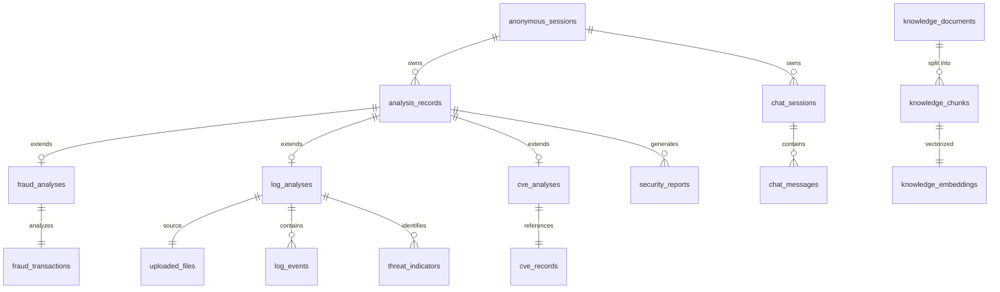

# Phase 0: Database Design

This document details the logical PostgreSQL data model for Sentrix AI. Supabase will be used as the managed PostgreSQL provider, utilizing the `pgvector` extension for RAG.

## ER Diagram (Mermaid)

## Entity Definitions

### 1. `anonymous_sessions`
* **Purpose**: Tracks anonymous users via UUID stored in secure cookies.
* **Primary Key**: `id` (UUID)
* **Columns**:
    * `id` (UUID, PK)
    * `created_at` (TIMESTAMP, NN)
    * `last_active_at` (TIMESTAMP, NN)
    * `ip_hash` (VARCHAR, Nullable) - Hashed for security if rate limiting needed
    * `user_agent` (VARCHAR, Nullable)
* **Lifecycle**: Can be expired/deleted if inactive for a set period (e.g., 30 days).

### 2. `analysis_records` (Abstract/Base Concept)
* **Purpose**: Centralized metadata table linking all analysis types to a session for easy history fetching.
* **Primary Key**: `id` (UUID)
* **Foreign Keys**: `session_id` -> `anonymous_sessions(id)`
* **Columns**:
    * `id` (UUID, PK)
    * `session_id` (UUID, NN, FK)
    * `analysis_type` (VARCHAR, NN) - ENUM: 'FRAUD', 'EVENT_LOG', 'CVE'
    * `status` (VARCHAR, NN) - ENUM: 'PENDING', 'COMPLETED', 'FAILED'
    * `risk_score` (INTEGER, Nullable) - Normalized 0-100 score
    * `severity` (VARCHAR, Nullable) - ENUM: 'LOW', 'MEDIUM', 'HIGH', 'CRITICAL'
    * `created_at` (TIMESTAMP, NN)
    * `completed_at` (TIMESTAMP, Nullable)
* **Indexes**: Index on `session_id`, `created_at`.

### 3. `fraud_analyses`
* **Purpose**: Results of a UPI fraud detection run.
* **Primary Key**: `analysis_id` (UUID) - Also FK to `analysis_records(id)`
* **Columns**:
    * `analysis_id` (UUID, PK, FK)
    * `fraud_probability` (DECIMAL, NN)
    * `ai_explanation` (TEXT, Nullable)
    * `model_version` (VARCHAR, Nullable)

### 4. `fraud_transactions`
* **Purpose**: The raw input data for the fraud analysis.
* **Primary Key**: `id` (UUID)
* **Foreign Keys**: `analysis_id` -> `fraud_analyses(analysis_id)`
* **Columns**:
    * `id` (UUID, PK)
    * `analysis_id` (UUID, NN, FK, Unique)
    * `amount` (DECIMAL, NN)
    * `transaction_timestamp` (TIMESTAMP, NN)
    * *(Other fields **TO BE FINALIZED** based on dataset)*

### 5. `uploaded_files`
* **Purpose**: Metadata for uploaded EVTX files.
* **Primary Key**: `id` (UUID)
* **Columns**:
    * `id` (UUID, PK)
    * `session_id` (UUID, NN, FK)
    * `original_filename` (VARCHAR, NN)
    * `storage_path` (VARCHAR, NN)
    * `file_size_bytes` (BIGINT, NN)
    * `mime_type` (VARCHAR, NN)
    * `created_at` (TIMESTAMP, NN)
* **Lifecycle**: Files deleted from object storage after parsing; this record remains as metadata.

### 6. `log_analyses`
* **Purpose**: Results of EVTX file parsing and threat detection.
* **Primary Key**: `analysis_id` (UUID) - Also FK to `analysis_records(id)`
* **Foreign Keys**: `file_id` -> `uploaded_files(id)`
* **Columns**:
    * `analysis_id` (UUID, PK, FK)
    * `file_id` (UUID, NN, FK, Unique)
    * `total_events_parsed` (INTEGER, NN)
    * `threats_detected` (INTEGER, NN)
    * `ai_summary` (TEXT, Nullable)

### 7. `log_events` (Optional / Aggregate)
* **Purpose**: Store important parsed events. (Avoid storing millions of benign events in PG; perhaps only store anomalous ones, or use JSONB for bulk).
* **Primary Key**: `id` (UUID)
* **Foreign Keys**: `analysis_id` -> `log_analyses(analysis_id)`
* **Columns**:
    * `id` (UUID, PK)
    * `analysis_id` (UUID, NN, FK)
    * `event_id` (INTEGER, NN)
    * `provider` (VARCHAR, Nullable)
    * `event_timestamp` (TIMESTAMP, NN)
    * `raw_data` (JSONB, Nullable) - Full event context
* **Indexes**: Index on `analysis_id`, `event_id`.

### 8. `threat_indicators`
* **Purpose**: Specific security alerts generated from `log_events`.
* **Primary Key**: `id` (UUID)
* **Foreign Keys**: `analysis_id` -> `log_analyses(analysis_id)`
* **Columns**:
    * `id` (UUID, PK)
    * `analysis_id` (UUID, NN, FK)
    * `indicator_type` (VARCHAR, NN) - e.g., 'LATERAL_MOVEMENT', 'PRIVILEGE_ESCALATION'
    * `description` (TEXT, NN)
    * `severity` (VARCHAR, NN)

### 9. `cve_records`
* **Purpose**: Local cache of CVE data from external APIs.
* **Primary Key**: `cve_id` (VARCHAR) - e.g., "CVE-2023-12345"
* **Columns**:
    * `cve_id` (VARCHAR, PK)
    * `description` (TEXT, NN)
    * `cvss_score` (DECIMAL, Nullable)
    * `published_date` (TIMESTAMP, Nullable)
    * `last_modified_date` (TIMESTAMP, Nullable)
    * `raw_api_response` (JSONB, Nullable) - Cache for missing fields
    * `fetched_at` (TIMESTAMP, NN)

### 10. `cve_analyses`
* **Purpose**: The user's specific query and AI explanation of a CVE.
* **Primary Key**: `analysis_id` (UUID) - Also FK to `analysis_records(id)`
* **Foreign Keys**: `cve_id` -> `cve_records(cve_id)`
* **Columns**:
    * `analysis_id` (UUID, PK, FK)
    * `cve_id` (VARCHAR, NN, FK)
    * `ai_explanation` (TEXT, Nullable)
    * `mitigation_advice` (TEXT, Nullable)

### 11. `chat_sessions`
* **Purpose**: Groups a conversation with the AI Assistant.
* **Primary Key**: `id` (UUID)
* **Foreign Keys**: `session_id` -> `anonymous_sessions(id)`
* **Columns**:
    * `id` (UUID, PK)
    * `session_id` (UUID, NN, FK)
    * `title` (VARCHAR, Nullable)
    * `created_at` (TIMESTAMP, NN)
    * `updated_at` (TIMESTAMP, NN)

### 12. `chat_messages`
* **Purpose**: Individual messages within a chat session.
* **Primary Key**: `id` (UUID)
* **Foreign Keys**: `chat_session_id` -> `chat_sessions(id)`
* **Columns**:
    * `id` (UUID, PK)
    * `chat_session_id` (UUID, NN, FK)
    * `role` (VARCHAR, NN) - ENUM: 'USER', 'ASSISTANT', 'SYSTEM'
    * `content` (TEXT, NN)
    * `created_at` (TIMESTAMP, NN)

### 13. `knowledge_documents` (RAG)
* **Purpose**: Track ingested cybersecurity documents.
* **Primary Key**: `id` (UUID)
* **Columns**:
    * `id` (UUID, PK)
    * `title` (VARCHAR, NN)
    * `source_url` (VARCHAR, Nullable)
    * `created_at` (TIMESTAMP, NN)

### 14. `knowledge_chunks` & `knowledge_embeddings` (RAG)
* **Purpose**: Store text chunks and vector embeddings (pgvector).
* **Primary Key**: `id` (UUID)
* **Foreign Keys**: `document_id` -> `knowledge_documents(id)`
* **Columns**:
    * `id` (UUID, PK)
    * `document_id` (UUID, NN, FK)
    * `content` (TEXT, NN)
    * `embedding` (VECTOR, NN) - pgvector type (Dimensions **TO BE DECIDED**)

### 15. `security_reports`
* **Purpose**: Store generated PDF/JSON report metadata.
* **Primary Key**: `id` (UUID)
* **Foreign Keys**: `analysis_id` -> `analysis_records(id)`
* **Columns**:
    * `id` (UUID, PK)
    * `analysis_id` (UUID, NN, FK)
    * `report_format` (VARCHAR, NN) - ENUM: 'PDF', 'JSON'
    * `storage_path` (VARCHAR, NN)
    * `created_at` (TIMESTAMP, NN)
