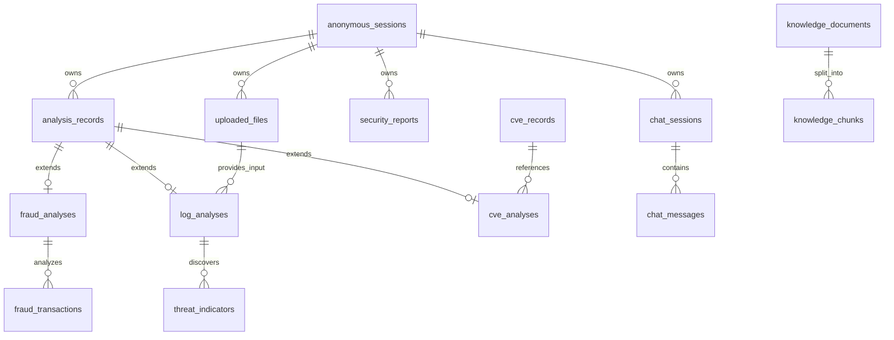

# Database Design

Logical PostgreSQL data model for Sentrix AI (hosted on Supabase).

## 1. Entities & Schema

### Session Management
* **`anonymous_sessions`**
  * **Purpose**: Durable record of sessions (Redis handles fast lookups/TTL, PG stores history).
  * **Columns**: `id` (UUID, PK), `created_at` (TIMESTAMPTZ), `last_active_at` (TIMESTAMPTZ), `ip_hash` (VARCHAR, optional/anonymized).

### Common Analysis
* **`analysis_records`**
  * **Purpose**: Centralized table for all analyses to enable unified history and dashboarding.
  * **Columns**: `id` (UUID, PK), `session_id` (UUID, FK -> anonymous_sessions), `analysis_type` (VARCHAR Enum: FRAUD, EVENT_LOG, CVE), `status` (VARCHAR Enum: PENDING, COMPLETED, FAILED), `risk_score` (INTEGER 0-100), `risk_classification` (VARCHAR Enum: LOW, MEDIUM, HIGH, CRITICAL), `created_at`, `updated_at`.

### Fraud
* **`fraud_analyses`**
  * **Purpose**: Results of fraud detection.
  * **Columns**: `id` (UUID, PK), `analysis_record_id` (UUID, FK, Unique), `model_version` (VARCHAR), `fraud_probability` (FLOAT), `ai_explanation` (TEXT).
* **`fraud_transactions`**
  * **Purpose**: The input transaction data.
  * **Columns**: `id` (UUID, PK), `fraud_analysis_id` (UUID, FK), `amount` (DECIMAL), `timestamp` (TIMESTAMPTZ), `features_json` (JSONB - for flexible model inputs).

### Event Logs
* **`uploaded_files`**
  * **Purpose**: Tracking uploaded EVTX/XML files.
  * **Columns**: `id` (UUID, PK), `session_id` (UUID, FK), `filename` (VARCHAR), `file_size_bytes` (BIGINT), `storage_path` (VARCHAR), `uploaded_at` (TIMESTAMPTZ).
* **`log_analyses`**
  * **Purpose**: Results of log parsing.
  * **Columns**: `id` (UUID, PK), `analysis_record_id` (UUID, FK, Unique), `uploaded_file_id` (UUID, FK), `total_events` (INTEGER), `suspicious_events` (INTEGER), `ai_summary` (TEXT).
* **`threat_indicators`**
  * **Purpose**: Specific threats found in the logs.
  * **Columns**: `id` (UUID, PK), `log_analysis_id` (UUID, FK), `event_id` (VARCHAR), `severity` (VARCHAR), `description` (TEXT).

### CVE
* **`cve_records`**
  * **Purpose**: Cache of external CVE data.
  * **Columns**: `id` (VARCHAR, PK - e.g., 'CVE-2023-1234'), `description` (TEXT), `cvss_score` (FLOAT), `published_date` (DATE), `last_updated` (TIMESTAMPTZ).
* **`cve_analyses`**
  * **Purpose**: User's specific analysis/query of a CVE.
  * **Columns**: `id` (UUID, PK), `analysis_record_id` (UUID, FK, Unique), `cve_id` (VARCHAR, FK), `ai_explanation` (TEXT).

### AI & Chat
* **`chat_sessions`**
  * **Purpose**: Grouping chat messages.
  * **Columns**: `id` (UUID, PK), `anonymous_session_id` (UUID, FK), `title` (VARCHAR), `created_at` (TIMESTAMPTZ).
* **`chat_messages`**
  * **Purpose**: Message history.
  * **Columns**: `id` (UUID, PK), `chat_session_id` (UUID, FK), `role` (VARCHAR Enum: USER, AI, SYSTEM), `content` (TEXT), `created_at` (TIMESTAMPTZ).

### RAG (Knowledge Base)
* **`knowledge_documents`**
  * **Purpose**: Source documents for RAG.
  * **Columns**: `id` (UUID, PK), `title` (VARCHAR), `source_url` (VARCHAR), `created_at`.
* **`knowledge_chunks`**
  * **Purpose**: Chunked text and embeddings for similarity search.
  * **Columns**: `id` (UUID, PK), `document_id` (UUID, FK), `content` (TEXT), `embedding` (VECTOR - pgvector type).

### Reports
* **`security_reports`**
  * **Purpose**: Generated reports.
  * **Columns**: `id` (UUID, PK), `session_id` (UUID, FK), `title` (VARCHAR), `storage_path` (VARCHAR), `created_at` (TIMESTAMPTZ).

## 2. Mermaid ER Diagram

## 3. Database Design Rules
* **UUID Strategy**: All primary keys (except external IDs like CVEs) use UUIDv4 generated by the application or database.
* **Timestamps**: All entities include `created_at`. Updatable entities include `updated_at`. Use `TIMESTAMPTZ` for timezone awareness.
* **JSONB**: Use only for flexible, non-indexed data (e.g., unstructured transaction features). Relational columns preferred.
* **pgvector**: Use for RAG embeddings. Requires `CREATE EXTENSION vector`.
* **Soft Deletes**: Not implemented by default to comply with minimal storage requirements. Retention policy (e.g., delete sessions older than 30 days) TO BE DECIDED.
* **Secrets**: No raw API keys or passwords stored in the database.
