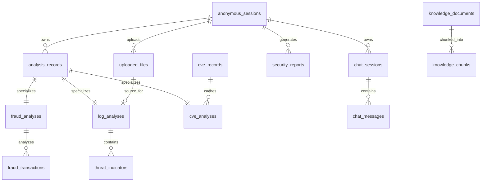

# Final Entity Relationship Diagram

```mermaid
erDiagram
    anonymous_sessions ||--o{ analysis_records : "owns"
    anonymous_sessions ||--o{ uploaded_files : "uploads"
    anonymous_sessions ||--o{ chat_sessions : "owns"
    anonymous_sessions ||--o{ security_reports : "generates"

    analysis_records ||--|| fraud_analyses : "specializes"
    analysis_records ||--|| log_analyses : "specializes"
    analysis_records ||--|| cve_analyses : "specializes"

    fraud_analyses ||--o{ fraud_transactions : "analyzes"
    
    uploaded_files ||--o| log_analyses : "source_for"
    log_analyses ||--o{ threat_indicators : "contains"
    
    cve_records ||--o{ cve_analyses : "caches"
    
    chat_sessions ||--o{ chat_messages : "contains"
    
    knowledge_documents ||--o{ knowledge_chunks : "chunked_into"
```
