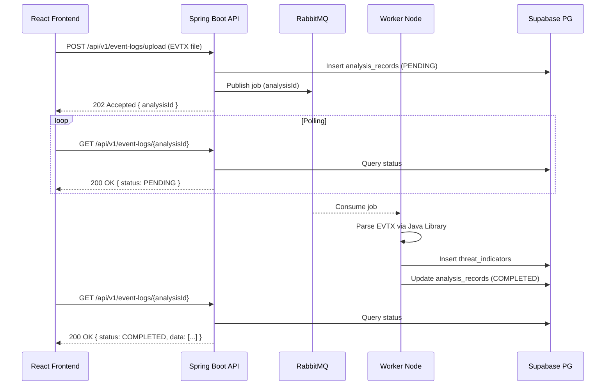

# API Sequence Diagrams

## Async Event Log Processing

```mermaid
sequenceDiagram
    participant UI as React Frontend
    participant API as Spring Boot API
    participant MQ as RabbitMQ
    participant W as Worker Node
    participant DB as Supabase PG

    UI->>API: POST /api/v1/event-logs/upload (EVTX file)
    API->>DB: Insert analysis_records (PENDING)
    API->>MQ: Publish job (analysisId)
    API-->>UI: 202 Accepted { analysisId }
    
    loop Polling
        UI->>API: GET /api/v1/event-logs/{analysisId}
        API->>DB: Query status
        API-->>UI: 200 OK { status: PENDING }
    end
    
    MQ-->>W: Consume job
    W->>W: Parse EVTX via Java Library
    W->>DB: Insert threat_indicators
    W->>DB: Update analysis_records (COMPLETED)
    
    UI->>API: GET /api/v1/event-logs/{analysisId}
    API->>DB: Query status
    API-->>UI: 200 OK { status: COMPLETED, data: [...] }
```
